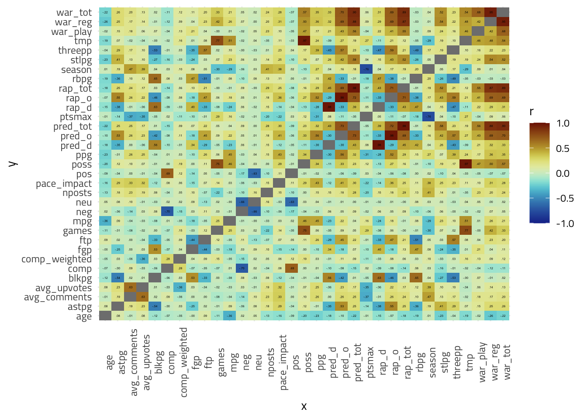
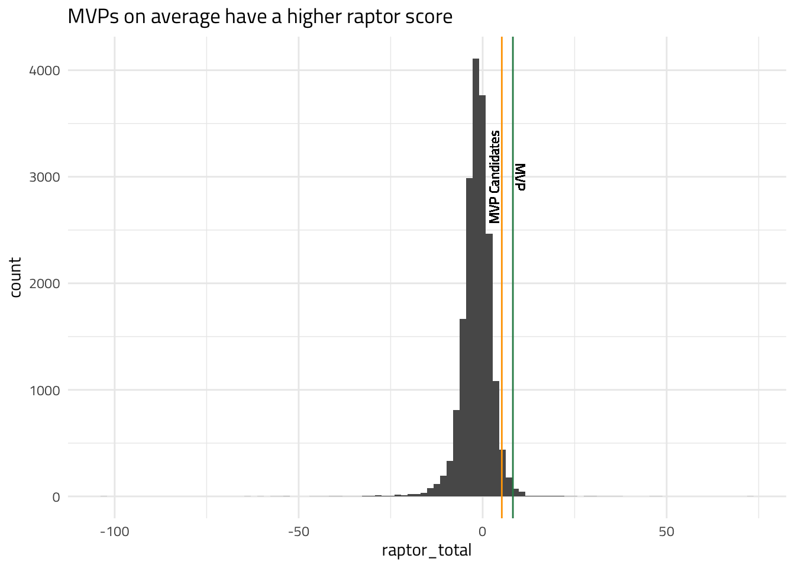
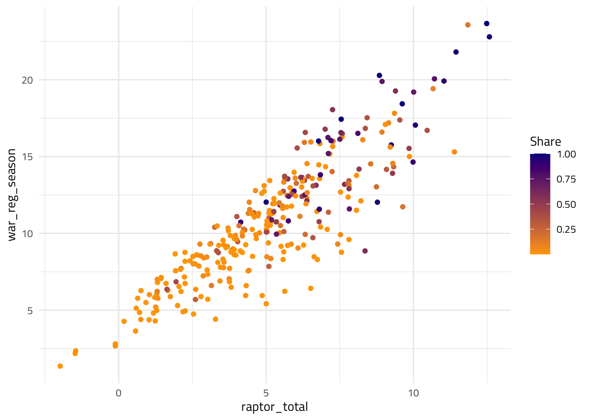
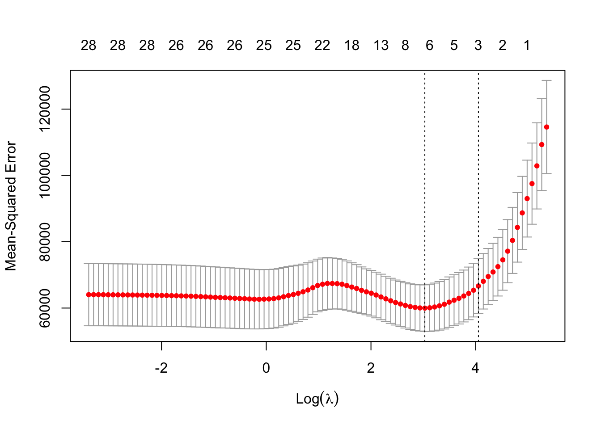

```{r setup, include=FALSE}
knitr::opts_chunk$set(echo = FALSE)
library(tidyverse)
library(reactable)
library(ggtext)
load("final.RData")

mvp_raw <- rbind(mvp, mvp2022)

theme_cons <- theme_minimal() +
  theme(text = element_text(family = "Titillium Web"),
        title = element_text(size = 24))

mvp_raw <- mvp_raw %>% 
    mutate(img = paste0(" <br>*", player, "<br>", season, "*")) 
```

## Outline {.build}

> - Background - what, why, how we're doing this
> - Data
> - Modeling
> - Results

## What am I doing? {.build}

To learn more about machine learning and the applications of machine learning, we applied machine learning to try to predict who will become the MVP for the NBA

## Background {.build}

> - NBA MVP is a well sought after award, rewarding the most valuable player (MVP) during the span of the season
> - It is often awarded to the players that have huge impact on the court
> - Famous MVPs include LeBron James, Steph Curry, Kevin Durant
> - All of which are known to have huge impact on the court

## The Problem {.build}

> - Picture this, you have $100 in Vegas, mid NBA season, and you want some money. 
> - You want a data-driven way of doing this
> - Why not put some money on some juicy odds for the NBA MVP?

## Dataset {.build}

Our data is a culmination of many data sources, specifically three

```{r}
head(mvp_raw) %>% 
  select(-1)
```

## Basic Data {.build}

We can use game-level statistics as key features for a player's importance. These statistics can include some basic stats like

> - Points Per Game (offensive metric)
> - Blocks Per Game (defensive metric)
> - Three Point % (offensive metric)
> - Many more...

Most of these stats were obtained from [basketball reference](https://www.basketball-reference.com/)

## Advanced Data {.build}

We also used advanced statistics which are computations based on game level statistics. These include:

> - WAR (impact score)
> - RAPTOR (descriptive statistic describing on-court performance)
> - PREDATOR (predictive RAPTOR)

These were obtained from from [FiveThirtyEight](https://github.com/fivethirtyeight/data/tree/master/nba-raptor) _Nate Silver does a great job introducing [RAPTOR](https://fivethirtyeight.com/features/introducing-raptor-our-new-metric-for-the-modern-nba/)_

## Sentiment Data {.build}

Now, to the crux of the project: _player sentiment_. 

On top of using basic statistics, we can add the public perception of a player to hopefully better predict the MVP.

To do this, we thought about running some text sentiment analysis on posts about each player.

These platforms/media were in consideration:

> - Twitter (_initial plan_)
> - Articles from ESPN/NYT
> - **Reddit**

## The Data {.build}

So to summarize,

> - Season per game statistics from [basketball reference](https://www.basketball-reference.com/)
> - WAR and Raptor metric data from [FiveThirtyEight](https://github.com/fivethirtyeight/data/tree/master/nba-raptor)
> - Posts from [r/NBA](https://www.reddit.com/r/nba/)

## Looking at some variables {.build}

Now that we have our complete dataset from 2010-2022, we can look for initial relationships between some variables.

This will give us an idea of what variables might become of use later on.

## Correlation matrix {.build .centered}

```{r}

```

## MVPs and their Raptor {.build .centered}

```{r}

```

## Raptor vs. WAR {.build .centered}

```{r}

```

## Looking at the sentiment {.build .centered}

```{r message=F}
mvp_raw %>% 
  ggplot() +
  geom_histogram(aes(x = comp), fill = "olivedrab") +
  theme_cons +
  labs("Distribution of Sentiment Scores")
```

## Most negatively perceived players (2010-2022) {.build .centered}

```{r message=F, fig.width=12, fig.height=7}
tneg <- head(mvp_raw[order(mvp_raw$comp), ], 10)
tneg$img <- factor(tneg$img, levels = tneg$img)

tneg %>% 
  ggplot() +
    geom_bar(aes(x = img, y = comp), stat = "identity", fill = "lightcoral", width = 0.5) +
    labs(x = "", y = "Sentiment", title = "Where is LeBron?") +
    scale_y_reverse() +
    theme_cons +
    theme(axis.text.x = element_markdown(color = "black", size = 8))
```

## Most positively perceived players (2010-2022) {.build .centered}

```{r message=F, fig.width=12, fig.height=7}
tpos <- head(mvp_raw[order(-mvp_raw$comp), ], 10)
tpos$img <- factor(tpos$img, levels = tpos$img)

tpos %>% 
  ggplot() +
  geom_bar(aes(x = img, y = comp), stat = "identity", fill = "lightgreen", width = 0.5) +
  labs(x = "", y = "Sentiment", title = "KD getting some Love") +
  theme_cons +
  theme(axis.text.x = element_markdown(color = "black", size = 8))
```

## Sentiment of MVPs (2010-2022) {.build .centered}

```{r message=F, fig.width=12, fig.height=7}
sentmvp <- mvp_raw %>% 
  filter(rank == 1) %>% 
  arrange(comp)

sentmvp$img <- factor(sentmvp$img, levels = sentmvp$img)

sentmvp %>% 
  ggplot() +
  geom_bar(aes(x = img, y = comp), stat = "identity", fill = ifelse(sentmvp$comp < 0, "lightcoral", "lightgreen"), width = 0.5) +
  labs(x = "", y = "Sentiment", title = "LeBron appears") +
  theme_cons +
  theme(axis.text.x = element_markdown(color = "black", size = 8))
```

## Let's get to modeling {.build}

Now that we have an initial idea of what our variables are

We can move to the fun part using Machine Learning

## Modeling process {.build}

> - Data pre processing
  > - Normalizing variables
  > - Selecting features
> - Testing different models
> - Evaluating results

## Models in consideration {.build}

> - Logistic Regression
> - LASSO Regression
> - Ridge Regression
> - Random Forest
> - XGBoost

## Models to focus on {.build}

Whilst I ran other models, these two models were of most importance to the project

> - LASSO Regression
> - XGBoost

## The prediction {.build}

Initially, I decided to predict one of the following

> - `mvppts` - number of votes received
> - `share` - share of votes received

## Considerations {.build}

There were a couple of things that were kept in mind

> - Variables had to be per game stats
> - Had to be obtainable during the middle of the season
> - (sampling changes due to season)

## Feature selection {.build}

Initially, I went in using a ton of features

However, removed a couple of features to 

## Regularization {.build}

To prevent overfitting, but mostly to help with feature selection, I used LASSO regression

Here is the result for the most ideal lambda (pretty high MSE)

```{r fig.align='center'}

```

## LASSO feature selection {.build}

LASSO picked out some features that did make some sense, these include

> - `ppg`
> - `rbpg`
> - `war_tot`
> - `war_reg`
> - `comp`

## Settling on XGBoost {.build}

I ended up choosing XGBoost and sticking with it for the remainder of the project.

## Evaluation

Instead of computing the _RMSE_ of the mvp points or share predicted, I decided it was better to gauge correctness based on the predicted rankings.

We are trying to predict the winner here, not the other candidates

## Results {.build}

```{r}
table_react2
```

## Reflection {.build}

This was a great learning experience, getting hands-on experience applying machine learning to real-world data.

The whole process was a huge learning experience, especially realizing that the majority of the data you want in the world is not readily available on the web. 

It's necessary that we spend time scraping and cleaning all this data to feed it to our models.

## Future {.build}

Apply other models

> - Deep Learning
> - Neural Nets

Test out model mid season

Adding more features to the model

Applying machine learning to more sports data!