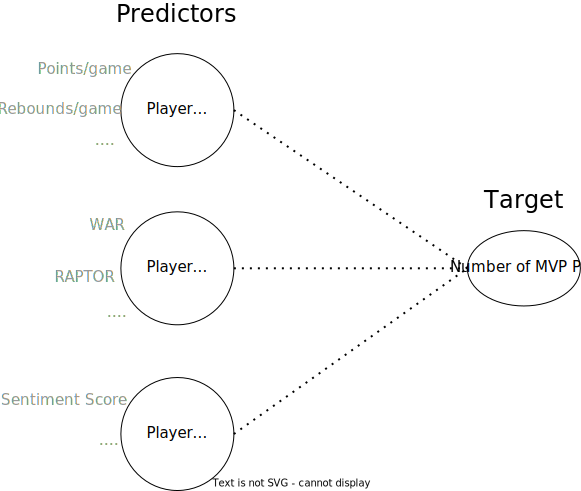
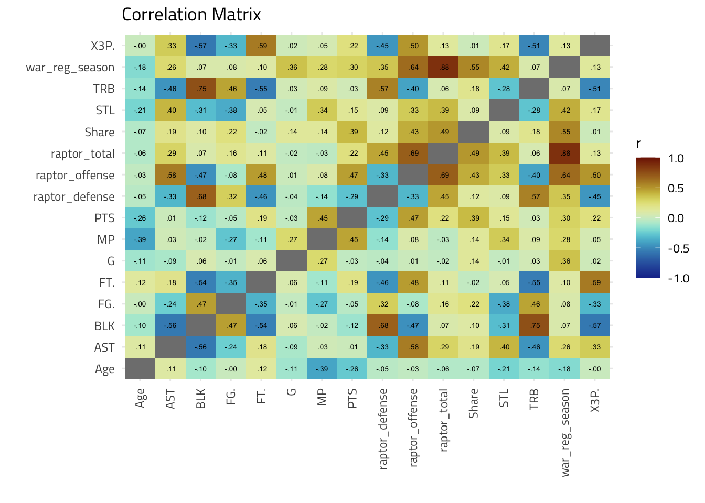

```{r setup, include=FALSE}
knitr::opts_chunk$set(echo = FALSE)
library(tidyverse)
library(reactable)
library(ggtext)
library(kableExtra)
library(cowplot)
library(formattable)
load("final.RData")
options("kableExtra.html.bsTable" = T)

theme_cons <- theme_minimal() +
  theme(text = element_text(family = "Titillium Web"),
        title = element_text(size = 24))

mvp_raw <- mvp_raw %>% 
    mutate(img = paste0(" <br>*", player, "<br>", season, "*"))

mvp_text <- read.csv("../data/sent_text_score.csv")

lasso_features_df <- data.frame("feature" = names(lasso_features), "coef" = lasso_features, row.names = NULL) %>% 
  arrange(-coef)
lasso_features_df$feature <- factor(lasso_features_df$feature, lasso_features_df$feature)

lasso_plot <- lasso_features_df %>% 
  filter(feature != "(Intercept)" & coef != 0) %>% 
  ggplot() +
  geom_bar(aes(x = feature, y = coef), stat = "identity") +
  theme(axis.text.x = element_text(angl = 45, hjust = 1)) +
  labs(x = "", y = "") +
  theme_cons +
  theme(text = element_text(size = 12))
```

<style>
div.footnotes {
  position: absolute;
  bottom: 0;
  margin-bottom: 10px;
  width: 80%;
  font-size: 0.6em;
}
</style>

<script src="https://ajax.googleapis.com/ajax/libs/jquery/3.1.1/jquery.min.js"></script>
<script>
$(document).ready(function() {
  $('slide:not(.backdrop):not(.title-slide)').append('<div class=\"footnotes\">');

  $('footnote').each(function(index) {
    var text  = $(this).html();
    var fnNum = (index+1).toString();
    $(this).html('');

    //var footnote   = '[.]'.replace('\.', fnNum) + '. ' + text + '<br/>';
    var footnote = text + '<br/>';
    $(this).parents('slide').children('div.footnotes').html(footnote);
  });
});
</script>

## Mission {.build data-background=#fff}

```{r fig.align='center'}
knitr::include_graphics("images/slideintro.svg")
```

<footnote>[1] https://fivethirtyeight.com/features/introducing-raptor-our-new-metric-for-the-modern-nba/</footnote>

<!-- - Talk about the goal of trying to predict the NBA MVP using Machine Learning -->
<!-- - Talk about each data source briefly -->
<!-- - Per game stats / MVP voting data -->
<!-- - how these players all received at least one mvp point -->
<!-- - RAPTOR/WAR data -->
<!-- - Sentiment data -->
<!-- - Mention what years are included in our modeling-->
<!-- - Briefly talk about what the data looks like (by row) -->
<!-- - when and what kinds of players are included -->

## Mission {.build}

> - 172 MVP candidates from 2010-2022
> - With 40 total variables

```{r}
mvp_raw[sample(172, 5), c(8:15)]
```

> - And 34 more variables...

## Sentiment Analysis {.build}

```{r fig.align='center'}
knitr::include_graphics("images/sentdiagram.svg")
```

> - Repeated for all ~3700 Reddit post titles
> - `vader`<sup>[3]</sup> package in R made it very straightforward

<footnote>[2] https://www.aaai.org/ocs/index.php/ICWSM/ICWSM14/paper/view/8109/8122
<br/>
[3] https://cran.r-project.org/web/packages/vader/index.html</footnote>

<!-- - using vader I computed the sentiment scores -->
<!-- - vader is a sentiment scoring is a way of capturing sentiment for social media -->
<!-- - it performed very well in tweets -->
<!-- - it's used to internet slang -->
<!-- - explain the process of how each score is obtained -->
<!-- - text is fed in -->
<!-- - then it's scored based on the word -->
<!-- - a compound valence score is the focus -->

## Sentiment Analysis {.build}

```{r message=FALSE, fig.height=6}
set.seed(123)
rows <- sample(nrow(mvp_text), 5)

mvp_text %>% 
  filter(X %in% rows & compound != 0) %>% 
  select(text, compound) %>% 
  rename("Example Text" = "text") %>% 
  rename("Sentiment Score (VADER<sup>[2]</sup>)" = "compound") %>% 
  kable(escape=FALSE) %>% 
  kable_styling(full_width = F, bootstrap_options = c("striped", "hover")) %>% 
  column_spec(2, color = "grey", background = ifelse(sign(mvp_text[mvp_text$X %in% rows & mvp_text$compound != 0,]$compound) == 1, "lightgreen", "lightcoral"))
```

<!-- - Briefly talk about how the data was obtained -->
<!-- - Talk about the usage of vader package in R to do the analysis -->
<!-- - Vader is built to analyze text from social media (built for the language of gen Z, almost) -->
<!-- - Result of the analysis: comp, neu, pos, neg -->
<!-- - Explain the meaning -->

<!-- ## Sentiment Example {.build} -->

<!-- ```{r message=F, fig.align='center', fig.width=14, fig.height=8} -->
<!-- tneg <- head(mvp_raw[order(mvp_raw$comp), ], 10) -->
<!-- tneg$img <- factor(tneg$img, levels = tneg$img) -->

<!-- tneg %>%  -->
<!--   ggplot() + -->
<!--     geom_bar(aes(x = img, y = comp), stat = "identity", fill = "lightcoral", width = 0.5) + -->
<!--     labs(x = "", y = "Sentiment", title = "") + -->
<!--     scale_y_reverse() + -->
<!--     theme_cons + -->
<!--     theme(axis.text.x = element_markdown(color = "black", size = 12)) -->
<!-- ``` -->

<!-- <!-- > - _"[Damian Lillard]"We Stuck""_ --> -->
<!-- <!-- _"Kyle Lowry and Kawhi Leonard could potentially go the same distance in the playoffs by losing the conference semi-finals."_ --> -->
<!-- > - _"Who else is worried about Chris Paul being 1 year older having missed major portions of the season due to injury 3 of the last 4 years?"_ - Chris Paul (2020) -->

<!-- ## Sentiment Example {.build} -->

<!-- ```{r message=F, fig.align='center', fig.width=14, fig.height=8} -->
<!-- tpos <- head(mvp_raw[order(-mvp_raw$comp), ], 10) -->
<!-- tpos$img <- factor(tpos$img, levels = tpos$img) -->

<!-- tpos %>%  -->
<!--   ggplot() + -->
<!--   geom_bar(aes(x = img, y = comp), stat = "identity", fill = "lightgreen", width = 0.5) + -->
<!--   labs(x = "", y = "Sentiment", title = "") + -->
<!--   theme_cons + -->
<!--   theme(axis.text.x = element_markdown(color = "black", size = 12)) -->
<!-- ``` -->

<!-- > - _"[Feldman] Kevin Durant says he appreciates fans who heckle him to get a release in their lives. "It’s fun, man, because it’s entertainment. So if you want to heckle or if you want to cheer, as long as you’re getting a release from whatever is going on in your normal life, that’s cool.""_ -->
<!-- > - _"another excellent highlight video from court chornicles showcasing kevin durant."_ - Kevin Durant (2010) -->

## Modeling {.build data-background=#fff}

```{r message=F, fig.align='center'}
# full_df2 %>% 
#   mutate(mvp = ifelse(rank == 1, "MVP", "Not MVP")) %>% 
#   ggplot() +
#   ggridges::geom_density_ridges(aes(x = mvppts, y =mvp , fill = mvp)) +
#   theme_cons +
#   labs(x = "MVP Points", y = "") +
#   theme(legend.position = "none",
#         axis.title.x = element_text(size = 12))

```

<!-- - what we're predicting -->
<!-- - explain what mvp points is -->
<!-- - how many first, second, third, fourth, fifth place votes a player received -->
<!-- - basically, a higher score the better -->

## Modeling {.build data-background=#fff}

```{r fig.align='center'}

```

<!-- - progression into modeling -->
<!-- - talk about correlations in some variables -->
<!-- - leads into feature selection -->

## Important Features {.build data-background=#fff}

<!-- - what features LASSO picked -->
<!-- - what other features were commonly marked was important -->
<!-- - common features of the models: random forest, lasso, and xgboost -->

```{r fig.align='center', fig.height=4}
knitr::include_graphics("images/impvars.svg")
```

## Important Features {.build}

```{r fig.align='center'}
lasso_plot
```

<!-- - explain the variables that were picked -->
<!-- - what I did with the variables -->
<!-- - what variables I decided to remove -->

## Results {.build}

```{r message=FALSE}
winner_accu <- real_tab2 %>% 
  data.frame() %>% 
  filter(rank == 1) %>% 
  summarize(accu = mean(rank == pred_rank)) %>%
  pull(accu)

pred_dev <- real_tab2 %>% 
  data.frame() %>% 
  mutate(dev = abs(rank - pred_rank)) %>% 
  summarize(avg_dev = sum(dev) / n()) %>% 
  pull(avg_dev) %>% 
  round(2)

real_tab2$comp <- color_tile("red", "green")(round(real_tab2$comp, 2))

tab2022 <- real_tab2 %>% 
  filter(season == 2022) %>% 
  ungroup(season) %>% 
  mutate(pred_rank = paste0(pred_rank, "\U2705")) %>% 
  select(player, rank, pred_rank, comp) %>% 
  mutate(temp = "") %>%
  relocate(temp, .before = player) %>% 
  kable(align = "clccc", escape = F, col.names = c("", "Player", "Rank", "Predicted Rank", "Sentiment Score")) %>% 
  kable_styling(full_width = T, bootstrap_options = c("striped", "hover")) %>% 
  column_spec(1, image = spec_image(real_tab2[real_tab2$season == 2022, ]$img, 120, 180)) %>% 
  column_spec(4, italic = T) %>% 
  column_spec(5, color = "white", width = "2cm")
```

> - Model was able to predict the MVP winner with _`r round(winner_accu, 2) * 100`\% accuracy_ (2010-2022)
> - With average deviation from actual rank of _`r pred_dev`_

Predictions for 2022 Season

```{r}
tab2022
```

<!-- - Instead of comparing RMSE, compare the predicted rank and real rank -->
<!-- - Only look at top 3 predicted -->
<!-- - Rationalize why we only looked at top 3 predicted -->

## Full Predictions

```{r}
table_react2
```

## Future

- Test out model midseason
- Add text sentiment analysis of famous critics like Stephen A Smith
- Use comments instead of headlines
- Comedy scores
- Account for jargon

## Reflection

- Learned the arduous task of gathering data
- How we different models can be used

## Resources Used For Presentaiton

- R package hexagons from https://www.tidymodels.org/
- Player headshots from https://www.basketball-reference.com/
- Diagrams created on https://app.diagrams.net
